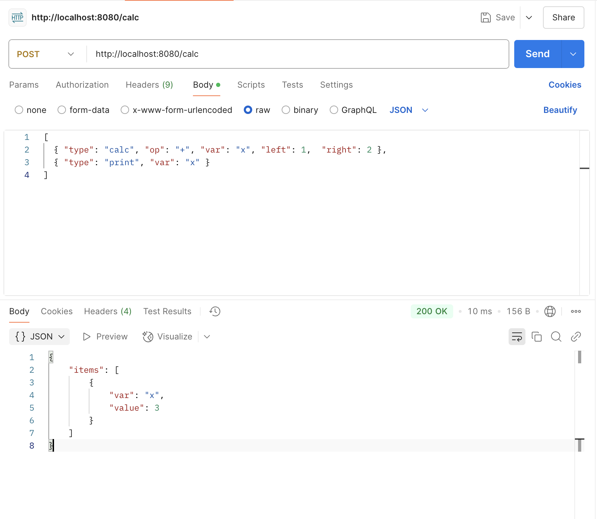
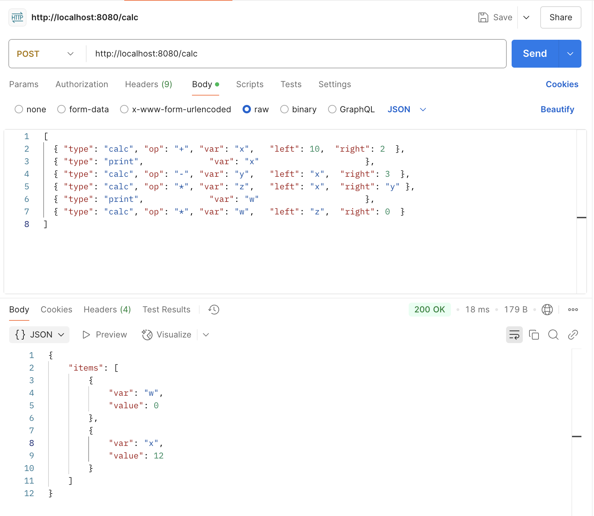
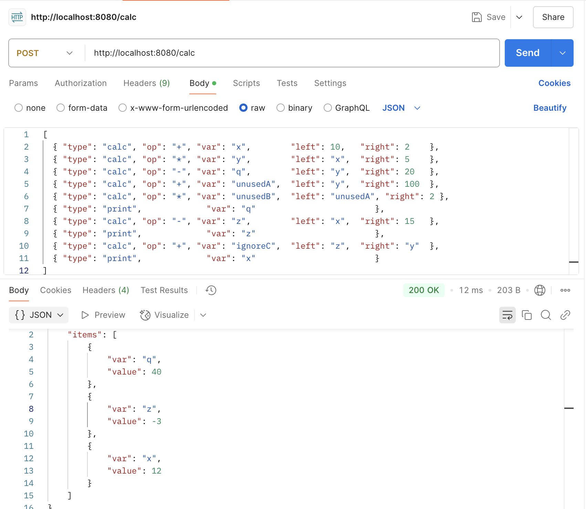
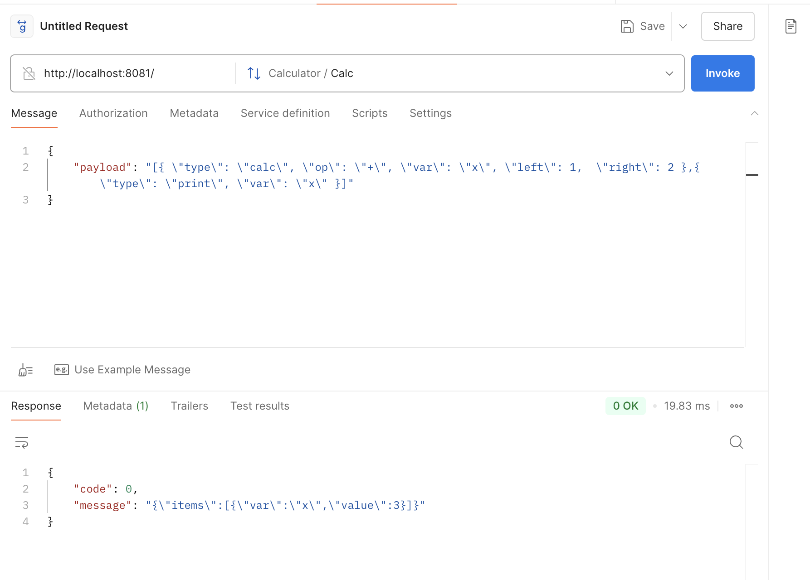

## First sample
### Request
```shell
curl --location 'http://localhost:8080/calc' \
--header 'Content-Type: application/json' \
--data '[
  { "type": "calc", "op": "+", "var": "x", "left": 1,  "right": 2 },
  { "type": "print", "var": "x" }
]'
```

### Response



## Second sample
### Request
```shell
curl --location 'http://localhost:8080/calc' \
--header 'Content-Type: application/json' \
--data '[
  { "type": "calc", "op": "+", "var": "x",   "left": 10,  "right": 2  },
  { "type": "print",             "var": "x"                     },
  { "type": "calc", "op": "-", "var": "y",   "left": "x",  "right": 3  },
  { "type": "calc", "op": "*", "var": "z",   "left": "x",  "right": "y" },
  { "type": "print",             "var": "w"                     },
  { "type": "calc", "op": "*", "var": "w",   "left": "z",  "right": 0  }
]'
```
### Response


## Third sample
### Request
```shell
curl --location 'http://localhost:8080/calc' \
--header 'Content-Type: application/json' \
--data '[
  { "type": "calc", "op": "+", "var": "x",        "left": 10,   "right": 2    },
  { "type": "calc", "op": "*", "var": "y",        "left": "x",  "right": 5    },
  { "type": "calc", "op": "-", "var": "q",        "left": "y",  "right": 20   },
  { "type": "calc", "op": "+", "var": "unusedA",  "left": "y",  "right": 100  },
  { "type": "calc", "op": "*", "var": "unusedB",  "left": "unusedA", "right": 2 },
  { "type": "print",             "var": "q"                        },
  { "type": "calc", "op": "-", "var": "z",        "left": "x",  "right": 15   },
  { "type": "print",             "var": "z"                        },
  { "type": "calc", "op": "+", "var": "ignoreC",  "left": "z",  "right": "y"  },
  { "type": "print",             "var": "x"                        }
]'
```
### Response


## Forth sample (GRPC)
### Request
```json
{
    "payload": "[{ \"type\": \"calc\", \"op\": \"+\", \"var\": \"x\", \"left\": 1,  \"right\": 2 },{ \"type\": \"print\", \"var\": \"x\" }]"
}
```

### Response
